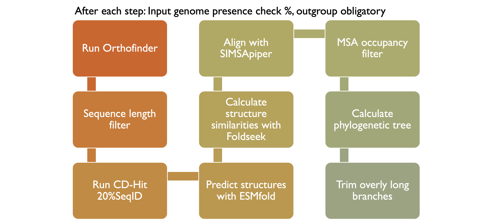

# ortholint
A nextflow pipeline that creates (or takes) orthologous groups from gene-called genomes and runs sequence- and structure based QC to remove outliers

## vision

## setup
You have to define your own dependency profile in *nextflow.config* unless you have access to the VUB-HPC. Use docker/apptainer to make your life easier. 

### Install requirements
- [Nextflow](https://www.nextflow.io/docs/latest/getstarted.html)
- [Singularity](https://apptainer.org/admin-docs/master/installation.html#installation-on-linux)/Apptainer or [Docker](https://docs.docker.com/get-docker/)
- Copy of this repository
  
- Orthofinder in [GitHub](https://github.com/davidemms/OrthoFinder), or [Docker](https://hub.docker.com/r/davidemms/orthofinder)
- CD-Hit eg. [GitHub](https://github.com/weizhongli/cdhit)
- Biopython
- BLAST (V2.14)
- Pandas
- ESMfold [GitHub](https://github.com/facebookresearch/esm)
- Foldseek [GitHub](https://github.com/steineggerlab/foldseek), or [Docker](https://hub.docker.com/r/mcpalumbo/foldseek)
- Copy of [SIMSApiper repository](https://github.com/Bio2Byte/simsapiper.git)
- IQ-TREE eg. [GitHub](https://github.com/iqtree/iqtree2)

## parameters
--data "$launchDir/data" \
--outFolder "$launchDir/" \
--structures false [path/to/structure/dir] \
--predictRemaining false \
--orthoGroupSeqs  [path/to/ogseqs/dir] \
--minCoverage 0.8 \
--outGroup  false [str_with_og_name] \
--foldseekClusters false 

